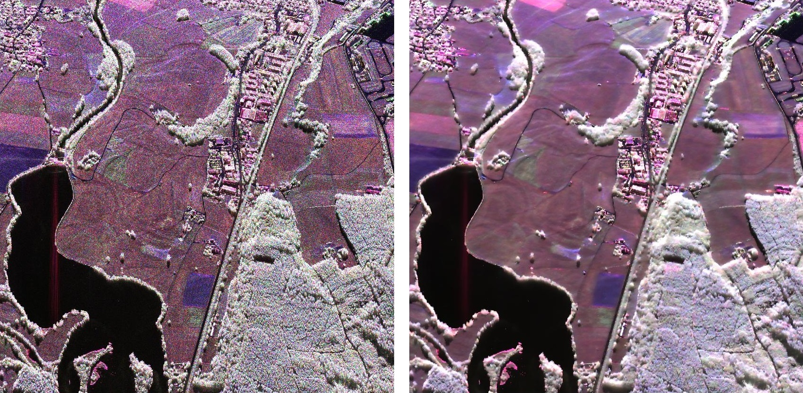

# POLSAR-image-denoising

This repo contains the C/Matlab codes for the super-fast noise filtering algorithm for polarimetric synthetic aperture radar (POLSAR) images as proposed in the following paper:

> Yi Cui, Yoshio Yamaguchi, Hirokazu Kobayashi, and Jian Yang. "Filtering of polarimetric synthetic aperture radar images: A sequential approach." In Geoscience and Remote Sensing Symposium (IGARSS), 2012 IEEE International, pp. 3138-3141. IEEE, 2012.

A demo to use the code to filter synthetic POLSAR images can be found in [demo.m](https://github.com/maycuiyan/POLSAR-image-denoising/blob/master/demo.m). The core functions [fPOLSARSMAP.c](https://github.com/maycuiyan/POLSAR-image-denoising/blob/master/fPOLSARSMAP.c) and [fPOLSARENL.c](https://github.com/maycuiyan/POLSAR-image-denoising/blob/master/fPOLSARENL.c) are written in C in order to leverage the speed advantage. However, for most users of the POLSAR community, the Matlab function [polsar_filter.m](https://github.com/maycuiyan/POLSAR-image-denoising/blob/master/polsar_filter.m) should be the most straightforward API to apply the filter to cleaning their own data.

The following figure shows an examplary result of our filter when applied to a real POLSAR image. On the left is the noisy image whereas on the right is the filtered image. The size of the image is **2500×2500**. Filtering such a large image only takes **0.87 seconds** on a mediocre PC. Super fast!

